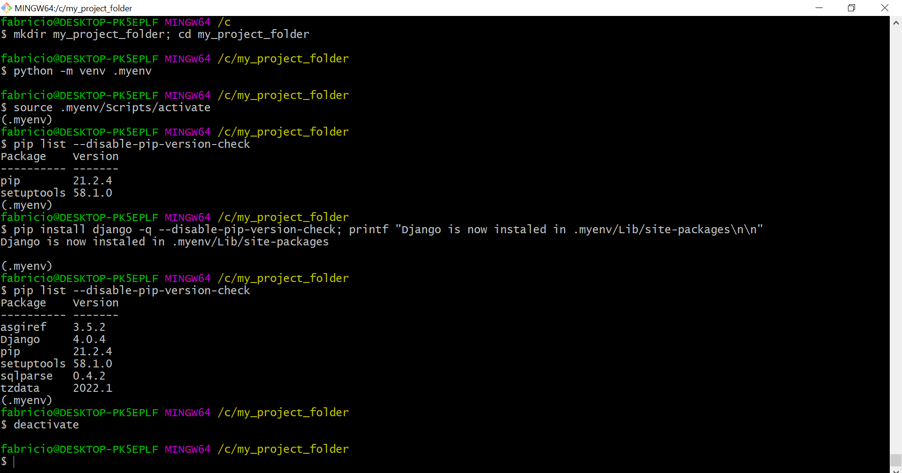

# Table of contents

1. [Description](#Description)
2. [How to create a virtual enviroment with *venv*](#how-to-create-a-virtual-enviroment-with-venv)
3. [About the subfolders created with `python -m venv .myenv`](#about-the-subfolders-created-with-python--m-venv-myenv)
4. [How to activate/deactivate a virtual enviroment with *venv*](#how-to-activatedeactivate-a-virtual-enviroment-with-venv)
5. [Screenshot with code example](#screenshot-with-code-example)

# Description

This tutorial shows how to create and activate a **virtual enviroment** in *Python* using the builtin module ***venv*** (check its [documentation here](https://docs.python.org/3/library/venv.html)).

We recomend that you use a Python stable version equal or higher than 3.10 in your projects.

My prefered terminal is GitBash, which allows me to write most Linux commands in my Windows Operational System (OS). Thus, some commands might need to be adapted to your other prefered terminals and OS. 

# How to create a virtual enviroment with *venv*

1. In your prefered terminal, create a folder to your new project (you can skip this step if your project folder already exists). Mine will be called `my_project_folder`:

>  ```mkdir my_project_folder```

2. Move inside the folder:

>  ```cd my_project_folder```

3. Run the command below to create the virtual environment.  I will call mine `.myenv` but you can name it whatever you want:

>  ```python -m venv .myenv```

The last command will take a little longer to finish running. Then a new folder `.myenv` (or whatever you called it) will be created inside your project folder. The `.myenv` folder has all the virtual environment files you need, including a copy from the Python version linked to the `python` alias you used in the command `**python** -m venv .myenv`.

# About the subfolders created with `python -m venv .myenv`

1. In Windows, the name of `.myenv` subfolders will be:

    i. `Include`

    ii. `Lib`
 
    iii. `Scripts`

2. In my Linux Ubuntu 20.4 (running in WSL), the following subfolders were created:
  
    i. `bin`
  
    ii. `include`
  
    iii. `lib`
  
    iv. `lib`
    
    v. `share`

I recommend that you explore these subfolders in the future, especially checking where the Python local version for the virtual environment is installed and where the future modules, to be installed with pip when the virtual environment is activated, will be saved inside the `.myenv` structure.

A very important note to make is that both the `Scripts` folder (in Windows) and `bin` (in Linux) are very similar and contain the binary files that will be used later to activate and deactivate the virtual environment.

# How to activate/deactivate a virtual enviroment with *venv*

1. To activate a virtual environment, choose the right command for your OS and terminal, as provided in the table below:

<p align="center">

<table>
    <thead>
        <td>Plataform</td>
        <td>Shell</td>
        <td>Command to activate virtual environment</td>
    </thead>
    <tbody>
        <tr>
            <td>POSIX</td>
            <td>bash/zsh</td>
            <td>$ source <venv>/bin/activate</td>
        </tr>
        <tr>
            <td>&nbsp;</td>
            <td>fish</td>
            <td>$ source <venv>/bin/activate.fish</td>
        </tr>
        
    </tbody>
</table>

</p>    
This table was copied from the [venv documentation](https://docs.python.org/3/library/venv.html), with the adition of the command for GitBash. Notice how this last one is very similar to their Linux counterparts, but it looks for the `activate` executable inside the `Scripts/` folder instead of `bin/` (which unexists in Windows).
    
2. To deactivate a virtual environment, just run this command:
> ```deactivate```
    
**IMPORTANT note 1**: The virtual environment will be activated only in your current terminal tab. If you want to work in multiple terminal tabs, don't forget to activate the virtual environment there too.
    
**Important note 2**: no third party modules will be installed inside your virtual environment. So, use `pip install <package_name>` or `pip install -r requirements.txt` to install the packages you need.

# Screenshot with code example
  
<p align="center">
    
</p>
